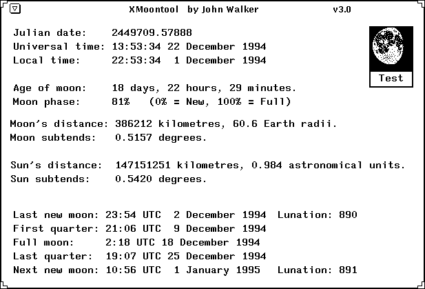

# Moontool

[](https://opensource.org/license/0BSD)
[](https://crates.io/crates/moontool)

John Walker's moontool.c astronomical calculation routines, extracted.

## Original

The original versions, [moontool](https://www.fourmilab.ch/moontool/)
and [moontoolw](https://www.fourmilab.ch/moontoolw/), are available at
John Walker's [fourmilab.ch](https://www.fourmilab.ch/).

Backup copies are included in the [`original/`](./original/) directory
of this repository.

<p align="center">
  
</p>

## License

Walker's program is in the public domain, and so is this project.

In Walker's words:

> Do what thou wilt shall be the whole of the law.

## Usage

To use the astronomical calculation routines, include `moon.h` and link
against C's standard math library (`-lm`).

It is C code, but can be used as-is in C++ projects[^cpp].

If in doubt, take a look at how the CLI is built in the
[`Makefile`](./Makefile).

[^cpp]:
    A C++ version of the CLI is available at
    [2df0bde](https://github.com/qrichert/moontool/blob/2df0bdef6d898bff955ea360075c20900af4c025/main.cpp).

## CLI

This version includes functions that print out info about the Moon, in a
way similar to the original program.

The CLI wraps these functions[^cli].

[^cli]:
    The C version of the CLI is a demo more than anything. The
    [Rust version](#ports-to-other-languages) has more functionality.

Run `make` and execute the resulting `moontool` program in the `build/`
directory.

You can run it bare for real-time data, pass it a datetime string or a
Unix timestamp (negative values allowed).

Use `-h` option for help.

To install it, run `make && sudo make install`.

```
$ moontool 1994-12-22T13:53:34

Phase
=====

Julian date:            2449709.07887   (0h variant: 2449709.57887)
Universal time:         Thursday  13:53:34 22 December 1994
Local time:             Thursday  14:53:34 22 December 1994

Age of moon:            18 days, 22 hours, 29 minutes.
Lunation:               64.13%   (🌖 Waning Gibbous)
Moon phase:             81.56%   (0% = New, 100% = Full)

Moon's distance:        386212 kilometres, 60.6 Earth radii.
Moon subtends:          0.5157 degrees.

Sun's distance:         147151251 kilometres, 0.984 astronomical units.
Sun subtends:           0.5420 degrees.

Moon Calendar
=============

Last new moon:          Friday    23:54 UTC  2 December 1994    Lunation: 890
First quarter:          Friday    21:06 UTC  9 December 1994
Full moon:              Sunday     2:18 UTC 18 December 1994
Last quarter:           Sunday    19:07 UTC 25 December 1994
Next new moon:          Sunday    10:56 UTC  1 January 1995     Lunation: 891
```

<details><summary>More examples</summary>
<p>

_(These are all part of the Rust CLI.)_

```
$ moontool --moon 1994-12-22T13:53:34
⠀⠀⠀⠀⠀⠀⠀⠀⠀⠀⠀⠀⠀⠀⠀⠀⠀⠀⠀⠀⠀⠀⠀⠀⠀⠀⠀⠀⠀⠀⠀⠀⠀⠀⠀⠀⠀⠀⠀⠀⠀⠀⠀⠀⠀⠀⠀⠀⠀⠀⠀⠀⠀⠀⠀⠀⠀⠀⠀⠀⠀⠀⠀⠀⠀⠀⠀⠀⠀⠀⠀⠀⠀⠀⠀⠀⠀⠀⠀⠀
⠀⠀⠀⠀⠀⠀⠀⠀⠀⠀⠀⠀⠀⠀⠀⠀⠀⠀⠀⠀⠀⠀⠀⠀⠀⠀⠀⠀⠀⠀⠀⠀⠀⠀⠀⠀⠀⠀⠀⠀⠀⠀⠀⠀⠀⠀⠀⠀⠀⠀⠀⠀⠀⠀⠀⠀⠀⠀⠀⠀⠀⠀⠀⠀⠀⠀⠀⠀⠀⠀⠀⠀⠀⠀⠀⠀⠀⠀⠀⠀
⠀⠀⠀⠀⠀⠀⠀⠀⠀⠀⠀⠀⠀⠀⠀⠀⠀⠀⠀⠀⠀⠀⠀⠀⠀⠀⠀⠀⠀⠀⠀⠀⠀⠀⠀⠀⠀⠀⠀⠀⠀⠀⠀⠀⠀⠀⠀⠀⠀⠀⠀⠀⠀⠀⠀⠀⠀⠀⠀⠀⠀⠀⠀⠀⠀⠀⠀⠀⠀⠀⠀⠀⠀⠀⠀⠀⠀⠀⠀⠀
⠀⠀⠀⠀⠀⠀⠀⠀⠀⠀⠀⠀⠀⠀⠀⠀⠀⠀⠀⠀⠀⠀⠀⠀⠀⠀⠀⠀⠀⠀⠀⠀⠀⠀⠀⠀⠀⠀⠀⠀⠀⠀⠀⠀⠀⠀⠀⠀⠀⠀⠀⠀⠀⠀⠀⠀⠀⠀⠀⠀⠀⠀⠀⠀⠀⠀⠀⠀⠀⠀⠀⠀⠀⠀⠀⠀⠀⠀⠀⠀
⠀⠀⠀⠀⠀⠀⠀⠀⠀⠀⠀⠀⠀⠀⠀⠀⠀⠀⠀⠀⠀⠀⠀⠀⠀⠀⠀⠀⠀⠀⠀⠀⠀⠀⠀⣀⡠⠤⠀⠠⠀⠀⠄⠀⠀⠀⠀⠀⠀⠀⠀⠀⠀⠀⠀⠀⠀⠀⠀⠀⠀⠀⠀⠀⠀⠀⠀⠀⠀⠀⠀⠀⠀⠀⠀⠀⠀⠀⠀⠀
⠀⠀⠀⠀⠀⠀⠀⠀⠀⠀⠀⠀⠀⠀⠀⠀⠀⠀⠀⠀⠀⠀⠀⠀⠀⠀⠀⠀⠀⠀⠀⠀⣠⠶⡥⠤⠖⠢⠴⢭⠭⡖⢔⠦⣤⡀⠀⠀⠀⠀⠀⠀⠀⠀⠀⠀⠀⠀⠀⠀⠀⠀⠀⠀⠀⠀⠀⠀⠀⠀⠀⠀⠀⠀⠀⠀⠀⠀⠀⠀
⠀⠀⠀⠀⠀⠀⠀⠀⠀⠀⠀⠀⠀⠀⠀⠀⠀⠀⠀⠀⠀⠀⠀⠀⠀⠀⠀⠀⠀⠀⠔⠓⢱⣎⣵⠚⠀⠀⠀⠀⠉⢿⣁⣷⣿⠙⢆⠀⠀⠀⠀⠀⠀⠀⠀⠀⠀⠀⠀⠀⠀⠀⠀⠀⠀⠀⠀⠀⠀⠀⠀⠀⠀⠀⠀⠀⠀⠀⠀⠀
⠀⠀⠀⠀⠀⠀⠀⠀⠀⠀⠀⠀⠀⠀⠀⠀⠀⠀⠀⠀⠀⠀⠀⠀⠀⠀⠀⠀⢠⠊⠁⠀⣀⠈⠁⠀⠀⡀⠀⠀⠀⢘⡗⠁⠈⠘⠙⠂⠀⠀⠀⠀⠀⠀⠀⠀⠀⠀⠀⠀⠀⠀⠀⠀⠀⠀⠀⠀⠀⠀⠀⠀⠀⠀⠀⠀⠀⠀⠀⠀
⠀⠀⠀⠀⠀⠀⠀⠀⠀⠀⠀⠀⠀⠀⠀⠀⠀⠀⠀⠀⠀⠀⠀⠀⠀⠀⠀⢠⡋⠀⡄⠁⠀⡢⣀⠰⣀⠂⠀⣀⣠⢉⠄⠀⠀⠀⠑⠀⠀⠀⠀⠀⠀⠀⠀⠀⠀⠀⠀⠀⠀⠀⠀⠀⠀⠀⠀⠀⠀⠀⠀⠀⠀⠀⠀⠀⠀⠀⠀⠀
⠀⠀⠀⠀⠀⠀⠀⠀⠀⠀⠀⠀⠀⠀⠀⠀⠀⠀⠀⠀⠀⠀⠀⠀⠀⠀⠀⣮⣥⠀⠀⢰⣁⣱⢈⡆⢘⣕⠂⠂⠀⠈⠈⡶⠢⠀⠀⠀⠀⠀⠀⠀⠀⠀⠀⠀⠀⠀⠀⠀⠀⠀⠀⠀⠀⠀⠀⠀⠀⠀⠀⠀⠀⠀⠀⠀⠀⠀⠀⠀
⠀⠀⠀⠀⠀⠀⠀⠀⠀⠀⠀⠀⠀⠀⠀⠀⠀⠀⠀⠀⠀⠀⠀⠀⠀⠀⠀⣇⢹⣇⢀⠀⠀⢉⢤⢛⡏⠥⡀⠘⠲⢤⣼⡕⠀⠀⢀⣄⠄⠀⠀⠀⠀⠀⠀⠀⠀⠀⠀⠀⠀⠀⠀⠀⠀⠀⠀⠀⠀⠀⠀⠀⠀⠀⠀⠀⠀⠀⠀⠀
⠀⠀⠀⠀⠀⠀⠀⠀⠀⠀⠀⠀⠀⠀⠀⠀⠀⠀⠀⠀⠀⠀⠀⠀⠀⠀⠈⣿⢿⣳⣮⣀⡀⠳⠌⠀⠻⢠⣼⠷⡎⢩⠉⠔⢠⠀⠾⠿⡅⠀⠀⠀⠀⠀⠀⠀⠀⠀⠀⠀⠀⠀⠀⠀⠀⠀⠀⠀⠀⠀⠀⠀⠀⠀⠀⠀⠀⠀⠀⠀
⠀⠀⠀⠀⠀⠀⠀⠀⠀⠀⠀⠀⠀⠀⠀⠀⠀⠀⠀⠀⠀⠀⠀⠀⠀⠀⠀⣟⡿⠟⣏⠀⠉⢐⠥⠁⠀⠉⣴⠡⡩⡩⢡⣿⡒⣄⣀⣼⡇⠀⠀⠀⠀⠀⠀⠀⠀⠀⠀⠀⠀⠀⠀⠀⠀⠀⠀⠀⠀⠀⠀⠀⠀⠀⠀⠀⠀⠀⠀⠀
⠀⠀⠀⠀⠀⠀⠀⠀⠀⠀⠀⠀⠀⠀⠀⠀⠀⠀⠀⠀⠀⠀⠀⠀⠀⠀⠀⠸⣏⢘⢸⣆⡀⠂⡨⡂⠤⡼⢁⠽⣉⣴⣟⢻⣮⣾⡂⡷⠂⠀⠀⠀⠀⠀⠀⠀⠀⠀⠀⠀⠀⠀⠀⠀⠀⠀⠀⠀⠀⠀⠀⠀⠀⠀⠀⠀⠀⠀⠀⠀
⠀⠀⠀⠀⠀⠀⠀⠀⠀⠀⠀⠀⠀⠀⠀⠀⠀⠀⠀⠀⠀⠀⠀⠀⠀⠀⠀⠀⠹⡮⡍⣙⠧⣑⡀⠊⠀⠃⠁⢖⣡⣶⡿⢯⠽⣖⣖⡄⠀⠀⠀⠀⠀⠀⠀⠀⠀⠀⠀⠀⠀⠀⠀⠀⠀⠀⠀⠀⠀⠀⠀⠀⠀⠀⠀⠀⠀⠀⠀⠀
⠀⠀⠀⠀⠀⠀⠀⠀⠀⠀⠀⠀⠀⠀⠀⠀⠀⠀⠀⠀⠀⠀⠀⠀⠀⠀⠀⠀⠀⠈⢮⡛⠭⣽⣥⠶⠀⡀⠀⢒⢶⣶⣿⡿⣿⣿⠟⠀⠀⠀⠀⠀⠀⠀⠀⠀⠀⠀⠀⠀⠀⠀⠀⠀⠀⠀⠀⠀⠀⠀⠀⠀⠀⠀⠀⠀⠀⠀⠀⠀
⠀⠀⠀⠀⠀⠀⠀⠀⠀⠀⠀⠀⠀⠀⠀⠀⠀⠀⠀⠀⠀⠀⠀⠀⠀⠀⠀⠀⠀⠀⠀⠉⠻⣍⡂⡴⡷⠲⠸⢞⠶⡤⣿⢿⡋⠋⠀⠀⠀⠀⠀⠀⠀⠀⠀⠀⠀⠀⠀⠀⠀⠀⠀⠀⠀⠀⠀⠀⠀⠀⠀⠀⠀⠀⠀⠀⠀⠀⠀⠀
⠀⠀⠀⠀⠀⠀⠀⠀⠀⠀⠀⠀⠀⠀⠀⠀⠀⠀⠀⠀⠀⠀⠀⠀⠀⠀⠀⠀⠀⠀⠀⠀⠀⠀⠉⠒⠳⠤⠤⠌⠁⠩⠌⠉⠀⠀⠀⠀⠀⠀⠀⠀⠀⠀⠀⠀⠀⠀⠀⠀⠀⠀⠀⠀⠀⠀⠀⠀⠀⠀⠀⠀⠀⠀⠀⠀⠀⠀⠀⠀
⠀⠀⠀⠀⠀⠀⠀⠀⠀⠀⠀⠀⠀⠀⠀⠀⠀⠀⠀⠀⠀⠀⠀⠀⠀⠀⠀⠀⠀⠀⠀⠀⠀⠀⠀⠀⠀⠀⠀⠀⠀⠀⠀⠀⠀⠀⠀⠀⠀⠀⠀⠀⠀⠀⠀⠀⠀⠀⠀⠀⠀⠀⠀⠀⠀⠀⠀⠀⠀⠀⠀⠀⠀⠀⠀⠀⠀⠀⠀⠀
⠀⠀⠀⠀⠀⠀⠀⠀⠀⠀⠀⠀⠀⠀⠀⠀⠀⠀⠀⠀⠀⠀⠀⠀⠀⠀⠀⠀⠀⠀⠀⠀⠀⠀⠀⠀⠀⠀⠀⠀⠀⠀⠀⠀⠀⠀⠀⠀⠀⠀⠀⠀⠀⠀⠀⠀⠀⠀⠀⠀⠀⠀⠀⠀⠀⠀⠀⠀⠀⠀⠀⠀⠀⠀⠀⠀⠀⠀⠀⠀
⠀⠀⠀⠀⠀⠀⠀⠀⠀⠀⠀⠀⠀⠀⠀⠀⠀⠀⠀⠀⠀⠀⠀⠀⠀⠀⠀⠀⠀⠀⠀⠀⠀⠀⠀⠀⠀⠀⠀⠀⠀⠀⠀⠀⠀⠀⠀⠀⠀⠀⠀⠀⠀⠀⠀⠀⠀⠀⠀⠀⠀⠀⠀⠀⠀⠀⠀⠀⠀⠀⠀⠀⠀⠀⠀⠀⠀⠀⠀⠀
⠀⠀⠀⠀⠀⠀⠀⠀⠀⠀⠀⠀⠀⠀⠀⠀⠀⠀⠀⠀⠀⠀⠀⠀⠀⠀⠀⠀⠀⠀⠀⠀⠀⠀⠀⠀⠀⠀⠀⠀⠀⠀⠀⠀⠀⠀⠀⠀⠀⠀⠀⠀⠀⠀⠀⠀⠀⠀⠀⠀⠀⠀⠀⠀⠀⠀⠀⠀⠀⠀⠀⠀⠀⠀⠀⠀⠀⠀⠀⠀
⠀⠀⠀⠀⠀⠀⠀⠀⠀⠀⠀⠀⠀⠀⠀⠀⠀⠀⠀⠀⠀⠀⠀⠀⠀⠀⠀⠀⠀⠀⠀⠀⠀⠀⠀⠀⠀⠀⠀⠀⠀⠀⠀⠀⠀⠀⠀⠀⠀⠀⠀⠀⠀⠀⠀⠀⠀⠀⠀⠀⠀⠀⠀⠀⠀⠀⠀⠀⠀⠀⠀⠀⠀⠀⠀⠀⠀⠀⠀⠀
⠀⠀⠀⠀⠀⠀⠀⠀⠀⠀⠀⠀⠀⠀⠀⠀⠀⠀⠀⠀⠀⠀⠀⠀⠀⠀⠀⠀⠀⠀⠀⠀⠀⠀⠀⠀⠀⠀⠀⠀⠀⠀⠀⠀⠀⠀⠀⠀⠀⠀⠀⠀⠀⠀⠀⠀⠀⠀⠀⠀⠀⠀⠀⠀⠀⠀⠀⠀⠀⠀⠀⠀⠀⠀⠀⠀⠀⠀⠀⠀
```

```
$ moontool --graph 1994-12-22T13:53:34

⠀⠀⠀⠀⠀⠀⠀⠀⠀⠀⠀⠀⠀⠀⠀⠀⠀⠀⠀⠀⠀⠀⠀⠀⠀⠀⠀⠀⠀⠀⠀⠀⠀⣀⠤⠔⠒⠉⠉⠉⠉⠉⠉⠉⠉⠒⠢⠤⣀⠀⠀⠀⢸⠀⠀⠀⠀⠀⠀⠀⠀⠀⠀⠀⠀⠀⠀⠀⠀⠀⠀⠀⠀⠀⠀⠀⠀⠀⠀⠀
⠀⠀⠀⠀⠀⠀⠀⠀⠀⠀⠀⠀⠀⠀⠀⠀⠀⠀⠀⠀⠀⠀⠀⠀⠀⠀⠀⠀⠀⢀⠤⠒⠉⠀⠀⠀⠀⠀⠀⠀⠀⠀⠀⠀⠀⠀⠀⠀⠀⠉⠢⢄⢸⠀⠀⠀⠀⠀⠀⠀⠀⠀⠀⠀⠀⠀⠀⠀⠀⠀⠀⠀⠀⠀⠀⠀⠀⠀⠀⠀
⠀⠀⠀⠀⠀⠀⠀⠀⠀⠀⠀⠀⠀⠀⠀⠀⠀⠀⠀⠀⠀⠀⠀⠀⠀⠀⢀⠤⠊⠁⠀⠀⠀⠀⠀⠀⠀⠀⠀⠀⠀⠀⠀⠀⠀⠀⠀⠀⠀⠀⠀⠀⢹⠢⡀⠀⠀⠀⠀⠀⠀⠀⠀⠀⠀⠀⠀⠀⠀⠀⠀⠀⠀⠀⠀⠀⠀⠀⠀⠀
⠀⠀⠀⠀⠀⠀⠀⠀⠀⠀⠀⠀⠀⠀⠀⠀⠀⠀⠀⠀⠀⠀⠀⠀⡠⠔⠁⠀⠀⠀⠀⠀⠀⠀⠀⠀⠀⠀⠀⠀⠀⠀⠀⠀⠀⠀⠀⠀⠀⠀⠀⠀⢸⠀⠈⠑⢄⠀⠀⠀⠀⠀⠀⠀⠀⠀⠀⠀⠀⠀⠀⠀⠀⠀⠀⠀⠀⠀⠀⠀
⠀⠀⠀⠀⠀⠀⠀⠀⠀⠀⠀⠀⠀⠀⠀⠀⠀⠀⠀⠀⠀⠀⡠⠊⠀⠀⠀⠀⠀⠀⠀⠀⠀⠀⠀⠀⠀⠀⠀⠀⠀⠀⠀⠀⠀⠀⠀⠀⠀⠀⠀⠀⢸⠀⠀⠀⠀⠑⢄⠀⠀⠀⠀⠀⠀⠀⠀⠀⠀⠀⠀⠀⠀⠀⠀⠀⠀⠀⠀⠀
⠀⠀⠀⠀⠀⠀⠀⠀⠀⠀⠀⠀⠀⠀⠀⠀⠀⠀⠀⢀⠔⠊⠀⠀⠀⠀⠀⠀⠀⠀⠀⠀⠀⠀⠀⠀⠀⠀⠀⠀⠀⠀⠀⠀⠀⠀⠀⠀⠀⠀⠀⠀⢸⠀⠀⠀⠀⠀⠀⠑⢄⠀⠀⠀⠀⠀⠀⠀⠀⠀⠀⠀⠀⠀⠀⠀⠀⠀⠀⠀
⠀⠀⠀⠀⠀⠀⠀⠀⠀⠀⠀⠀⠀⠀⠀⠀⠀⢀⠔⠁⠀⠀⠀⠀⠀⠀⠀⠀⠀⠀⠀⠀⠀⠀⠀⠀⠀⠀⠀⠀⠀⠀⠀⠀⠀⠀⠀⠀⠀⠀⠀⠀⢸⠀⠀⠀⠀⠀⠀⠀⠀⠑⢄⠀⠀⠀⠀⠀⠀⠀⠀⠀⠀⠀⠀⠀⠀⠀⠀⠀
⠀⠀⠀⠀⠀⠀⠀⠀⠀⠀⠀⠀⠀⠀⠀⢀⠔⠁⠀⠀⠀⠀⠀⠀⠀⠀⠀⠀⠀⠀⠀⠀⠀⠀⠀⠀⠀⠀⠀⠀⠀⠀⠀⠀⠀⠀⠀⠀⠀⠀⠀⠀⢸⠀⠀⠀⠀⠀⠀⠀⠀⠀⠀⠑⢄⠀⠀⠀⠀⠀⠀⠀⠀⠀⠀⠀⠀⠀⠀⠀
⠀⠀⠀⠀⠀⠀⠀⠀⠀⠀⠀⠀⠀⢀⠔⠁⠀⠀⠀⠀⠀⠀⠀⠀⠀⠀⠀⠀⠀⠀⠀⠀⠀⠀⠀⠀⠀⠀⠀⠀⠀⠀⠀⠀⠀⠀⠀⠀⠀⠀⠀⠀⢸⠀⠀⠀⠀⠀⠀⠀⠀⠀⠀⠀⠀⠑⢄⠀⠀⠀⠀⠀⠀⠀⠀⠀⠀⠀⠀⠀
⠀⠀⠀⠀⠀⠀⠀⠀⠀⠀⠀⡠⠔⠁⠀⠀⠀⠀⠀⠀⠀⠀⠀⠀⠀⠀⠀⠀⠀⠀⠀⠀⠀⠀⠀⠀⠀⠀⠀⠀⠀⠀⠀⠀⠀⠀⠀⠀⠀⠀⠀⠀⢸⠀⠀⠀⠀⠀⠀⠀⠀⠀⠀⠀⠀⠀⠀⠑⢄⠀⠀⠀⠀⠀⠀⠀⠀⠀⠀⠀
⠀⠀⠀⠀⠀⠀⠀⠀⢀⡠⠊⠀⠀⠀⠀⠀⠀⠀⠀⠀⠀⠀⠀⠀⠀⠀⠀⠀⠀⠀⠀⠀⠀⠀⠀⠀⠀⠀⠀⠀⠀⠀⠀⠀⠀⠀⠀⠀⠀⠀⠀⠀⢸⠀⠀⠀⠀⠀⠀⠀⠀⠀⠀⠀⠀⠀⠀⠀⠀⠑⢄⡀⠀⠀⠀⠀⠀⠀⠀⠀
⠀⠀⠀⠀⠀⢀⡠⠔⠁⠀⠀⠀⠀⠀⠀⠀⠀⠀⠀⠀⠀⠀⠀⠀⠀⠀⠀⠀⠀⠀⠀⠀⠀⠀⠀⠀⠀⠀⠀⠀⠀⠀⠀⠀⠀⠀⠀⠀⠀⠀⠀⠀⢸⠀⠀⠀⠀⠀⠀⠀⠀⠀⠀⠀⠀⠀⠀⠀⠀⠀⠀⠈⠢⢄⡀⠀⠀⠀⠀⠀
⡠⠤⠤⠔⠊⠁⠀⠀⠀⠀⠀⠀⠀⠀⠀⠀⠀⠀⠀⠀⠀⠀⠀⠀⠀⠀⠀⠀⠀⠀⠀⠀⠀⠀⠀⠀⠀⠀⠀⠀⠀⠀⠀⠀⠀⠀⠀⠀⠀⠀⠀⠀⢸⠀⠀⠀⠀⠀⠀⠀⠀⠀⠀⠀⠀⠀⠀⠀⠀⠀⠀⠀⠀⠀⠈⠑⠢⠤⠤⠤
🌑      🌒         🌓         🌔         🌕        🌖       🌗        🌘      🌑

Moon phases 1994
⢆⠀⠀⠀⠀⡜⢱⠀⠀⠀⠀⡰⠉⡆⠀⠀⠀⢀⠎⢣⠀⠀⠀⠀⡰⠱⡀⠀⠀⠀⢠⠋⢆⠀⠀⠀⠀⡜⠱⡀⠀⠀⠀⢰⠉⡆⠀⠀⠀⢀⠎⢱⠀⠀⠀⠀⡜⠉⡆⠀⠀⠀⢠⠋⢱⠀⠀⠀⠀⡜⠉⡆⠀⠀⠀⢠⠋⣧⠀⠀
⠘⡄⠀⠀⡸⠀⠀⢇⠀⠀⢀⠇⠀⢸⠀⠀⠀⡸⠀⠈⡆⠀⠀⢠⠃⠀⢣⠀⠀⠀⡜⠀⠘⡄⠀⠀⢰⠁⠀⢣⠀⠀⠀⡇⠀⠸⡀⠀⠀⡜⠀⠀⢇⠀⠀⢰⠁⠀⠸⡀⠀⠀⡎⠀⠀⢇⠀⠀⢸⠀⠀⠸⡀⠀⢀⠇⠀⡏⡆⠀
⠀⢣⠀⢠⠃⠀⠀⠸⡀⠀⡜⠀⠀⠀⡇⠀⢠⠃⠀⠀⢱⠀⠀⡜⠀⠀⠈⡆⠀⢰⠁⠀⠀⢱⠀⠀⡎⠀⠀⠘⡄⠀⡸⠀⠀⠀⢣⠀⢠⠃⠀⠀⠘⡄⠀⡎⠀⠀⠀⢣⠀⢸⠀⠀⠀⠸⡀⢀⠇⠀⠀⠀⢇⠀⡸⠀⠀⡇⢸⠀
⠀⠈⠦⠊⠀⠀⠀⠀⠱⠔⠁⠀⠀⠀⠘⠤⠊⠀⠀⠀⠀⠣⠔⠁⠀⠀⠀⠘⠤⠃⠀⠀⠀⠀⠣⠜⠀⠀⠀⠀⠘⠤⠃⠀⠀⠀⠀⠣⠎⠀⠀⠀⠀⠱⡸⠀⠀⠀⠀⠈⠦⠃⠀⠀⠀⠀⠱⠜⠀⠀⠀⠀⠈⠦⠃⠀⠀⡇⠀⠣
```

```
$ moontool --json --verbose 1994-12-22T13:53:34
{"phase":{"julian_date":2449709.078865741,"timestamp":788104414,"utc_datetime":"1994-12-22T13:53:34Z","age":18.93744836966762,"fraction_of_lunation":0.6412824537593207,"phase":{"index":5,"name":"Waning Gibbous","icon":"🌖"},"fraction_illuminated":0.815597324336816,"ecliptic_longitude":141.3961136662877,"ecliptic_latitude":-7.2584706818538205,"parallax":0.9462397831826777,"distance_to_earth_km":386212.9210746231,"distance_to_earth_earth_radii":60.55240399654809,"subtends":0.5156693296170667,"sun_ecliptic_longitude":270.49836358716567,"sun_distance_to_earth_km":147151251.1218971,"sun_distance_to_earth_astronomical_units":0.983641220479464,"sun_subtends":0.5419943663403342},"calendar":{"julian_date":2449709.078865741,"timestamp":788104414,"utc_datetime":"1994-12-22T13:53:34Z","lunation":890,"last_new_moon":2449689.4962275415,"last_new_moon_utc":"1994-12-02T23:54:34Z","first_quarter":2449696.379674719,"first_quarter_utc":"1994-12-09T21:06:44Z","full_moon":2449704.5961089605,"full_moon_utc":"1994-12-18T02:18:24Z","last_quarter":2449712.296738699,"last_quarter_utc":"1994-12-25T19:07:18Z","next_new_moon":2449718.9561368735,"next_new_moon_utc":"1995-01-01T10:56:50Z"},"yearly_calendar":{"julian_date":2449709.078865741,"timestamp":788104414,"new_moons":[{"date":2449364.466461601,"date_utc":"1994-01-11T23:11:42Z"},{"date":2449394.1053330023,"date_utc":"1994-02-10T14:31:41Z"},{"date":2449423.796219726,"date_utc":"1994-03-12T07:06:33Z"},{"date":2449453.513123169,"date_utc":"1994-04-11T00:18:54Z"},{"date":2449483.2139252475,"date_utc":"1994-05-10T17:08:03Z"},{"date":2449512.852505584,"date_utc":"1994-06-09T08:27:36Z"},{"date":2449542.4013906033,"date_utc":"1994-07-08T21:38:00Z"},{"date":2449571.864828284,"date_utc":"1994-08-07T08:45:21Z"},{"date":2449601.272747484,"date_utc":"1994-09-05T18:32:45Z"},{"date":2449630.6633196543,"date_utc":"1994-10-05T03:55:11Z"},{"date":2449660.0664278977,"date_utc":"1994-11-03T13:35:39Z"},{"date":2449689.4962275415,"date_utc":"1994-12-02T23:54:34Z"}],"full_moons":[{"date":2449380.0586447124,"date_utc":"1994-01-27T13:24:27Z","name":"Wolf Moon"},{"date":2449409.5533055435,"date_utc":"1994-02-26T01:16:46Z","name":"Snow Moon"},{"date":2449438.96606304,"date_utc":"1994-03-27T11:11:08Z","name":"Worm Moon"},{"date":2449468.3236192437,"date_utc":"1994-04-25T19:46:01Z","name":"Pink Moon"},{"date":2449497.6524686604,"date_utc":"1994-05-25T03:39:33Z","name":"Flower Moon"},{"date":2449526.981210815,"date_utc":"1994-06-23T11:32:57Z","name":"Strawberry Moon"},{"date":2449556.3442921047,"date_utc":"1994-07-22T20:15:47Z","name":"Buck Moon"},{"date":2449585.782307023,"date_utc":"1994-08-21T06:46:31Z","name":"Sturgeon Moon"},{"date":2449615.333580816,"date_utc":"1994-09-19T20:00:21Z","name":"Harvest Moon"},{"date":2449645.012958655,"date_utc":"1994-10-19T12:18:40Z","name":"Hunter's Moon"},{"date":2449674.790592812,"date_utc":"1994-11-18T06:58:27Z","name":"Beaver Moon"},{"date":2449704.5961089605,"date_utc":"1994-12-18T02:18:24Z","name":"Cold Moon"}]},"sun_calendar":{"julian_date":2449709.078865741,"timestamp":788104414,"utc_datetime":"1994-12-22T13:53:34Z","march_equinox":2449432.353579861,"march_equinox_utc":"1994-03-20T20:29:09Z","june_solstice":2449525.1174054933,"june_solstice_utc":"1994-06-21T14:49:04Z","september_equinox":2449618.7643152755,"september_equinox_utc":"1994-09-23T06:20:37Z","december_solstice":2449708.5998854158,"december_solstice_utc":"1994-12-22T02:23:50Z"}}
```

</p>
</details>

## Others

### Ports to Other Languages

- `rust/src/moon.rs` A port to Rust.
- `python/moon/moon.py` A port to Python.

The C and Python versions stick as closely as possible to the original.

The Rust version takes some liberties to provide a nicer API (the
calculations do no change however). It also exposes the Moon's ecliptic
longitude, ecliptic latitude, and parallax, and the Sun's ecliptic
longitude. All four of them are calculated in the original, but the
values are never used.

The Rust version also includes additional features and an augmented CLI.

### And Also

This repo [also includes](./others):

- `moonsim.sh` A shell script that simulates a lunation.
- `web.py` A simple Python script that serves the CLI over the web.

<p align="center">
⠀⠀⠀⠀⠀⠀⠀⠀⠀⠀⠀⠀⠀⠀⠀⠀⠀⠀⠀⠀⠀⠀⠀⠀⠀⠀⠀⠀<br />
⠀⠀⠀⠀⠀⠀⠀⠀⠀⣀⡠⠤⠀⠠⠀⠀⠄⠀⠀⠀⠀⠀⠀⠀⠀⠀⠀⠀<br />
⠀⠀⠀⠀⠀⠀⣠⠶⡥⠤⠖⠢⠴⢭⠭⡖⢔⠦⣤⡀⠀⠀⠀⠀⠀⠀⠀⠀<br />
⠀⠀⠀⠀⠔⠓⢱⣎⣵⠚⠀⠀⠀⠀⠉⢿⣁⣷⣿⠙⢆⠀⠀⠀⠀⠀⠀⠀<br />
⠀⠀⢠⠊⠁⠀⣀⠈⠁⠀⠀⡀⠀⠀⠀⢘⡗⠁⠈⠘⠙⠂⠀⠀⠀⠀⠀⠀<br />
⠀⢠⡋⠀⡄⠁⠀⡢⣀⠰⣀⠂⠀⣀⣠⢉⠄⠀⠀⠀⠑⠀⠀⠀⠀⠀⠀⠀<br />
⠀⣮⣥⠀⠀⢰⣁⣱⢈⡆⢘⣕⠂⠂⠀⠈⠈⡶⠢⠀⠀⠀⠀⠀⠀⠀⠀⠀<br />
⠀⣇⢹⣇⢀⠀⠀⢉⢤⢛⡏⠥⡀⠘⠲⢤⣼⡕⠀⠀⢀⣄⠄⠀⠀⠀⠀⠀<br />
⠈⣿⢿⣳⣮⣀⡀⠳⠌⠀⠻⢠⣼⠷⡎⢩⠉⠔⢠⠀⠾⠿⡅⠀⠀⠀⠀⠀<br />
⠀⣟⡿⠟⣏⠀⠉⢐⠥⠁⠀⠉⣴⠡⡩⡩⢡⣿⡒⣄⣀⣼⡇⠀⠀⠀⠀⠀<br />
⠀⠸⣏⢘⢸⣆⡀⠂⡨⡂⠤⡼⢁⠽⣉⣴⣟⢻⣮⣾⡂⡷⠂⠀⠀⠀⠀⠀<br />
⠀⠀⠹⡮⡍⣙⠧⣑⡀⠊⠀⠃⠁⢖⣡⣶⡿⢯⠽⣖⣖⡄⠀⠀⠀⠀⠀⠀<br />
⠀⠀⠀⠈⢮⡛⠭⣽⣥⠶⠀⡀⠀⢒⢶⣶⣿⡿⣿⣿⠟⠀⠀⠀⠀⠀⠀⠀<br />
⠀⠀⠀⠀⠀⠉⠻⣍⡂⡴⡷⠲⠸⢞⠶⡤⣿⢿⡋⠋⠀⠀⠀⠀⠀⠀⠀⠀<br />
⠀⠀⠀⠀⠀⠀⠀⠀⠉⠒⠳⠤⠤⠌⠁⠩⠌⠉⠀⠀⠀⠀⠀⠀⠀⠀⠀⠀<br />
⠀⠀⠀⠀⠀⠀⠀⠀⠀⠀⠀⠀⠀⠀⠀⠀⠀⠀⠀⠀⠀⠀⠀⠀⠀⠀⠀⠀<br />
</p>
